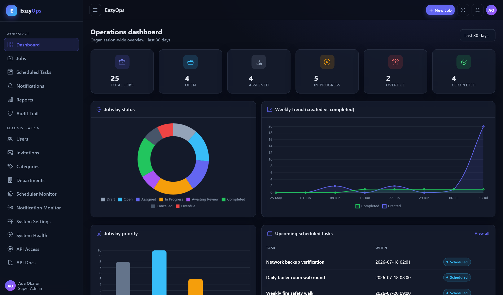
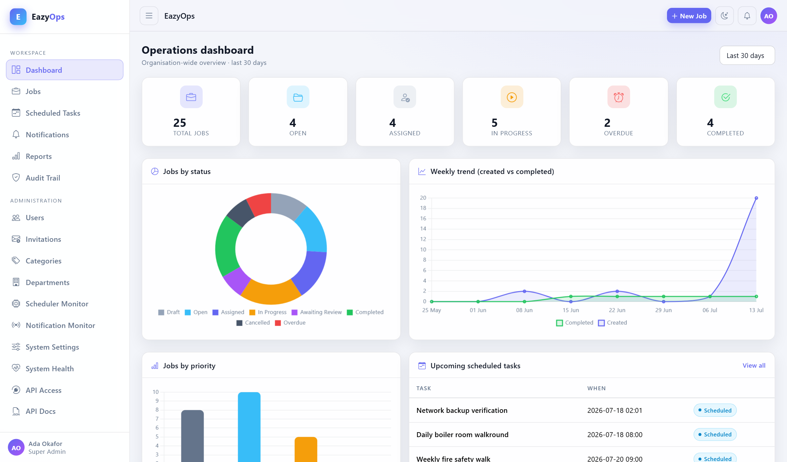
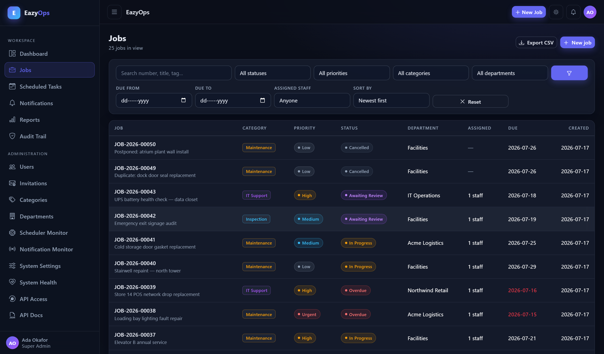
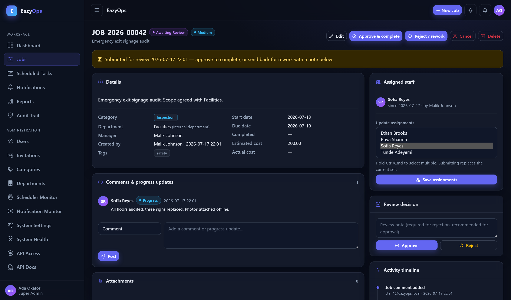
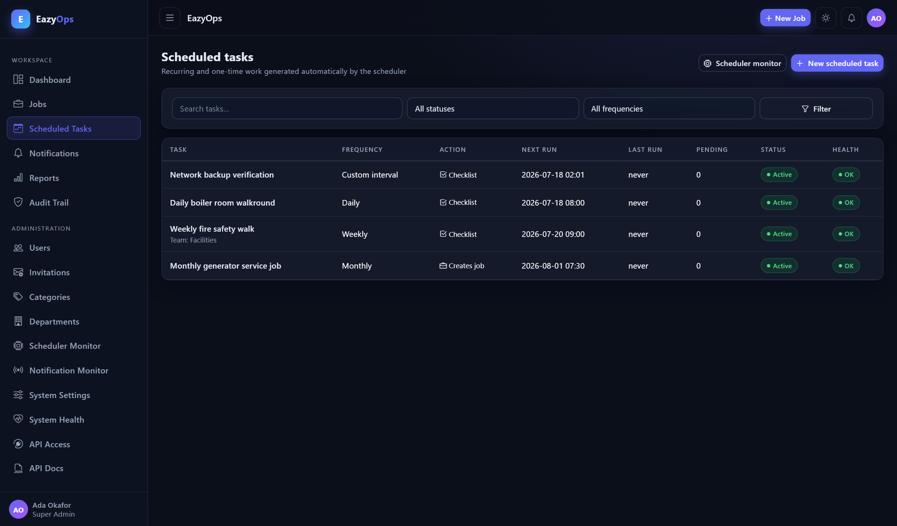
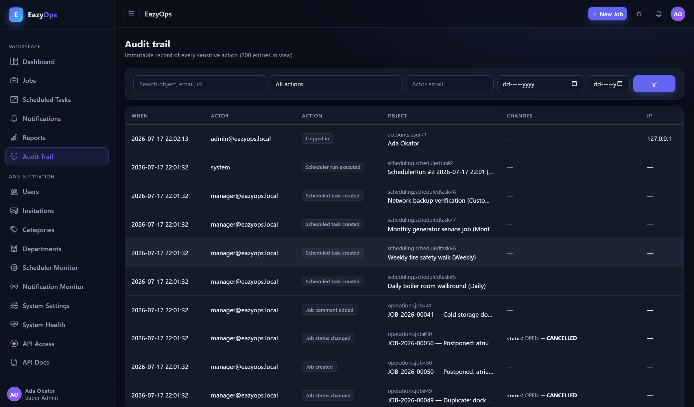
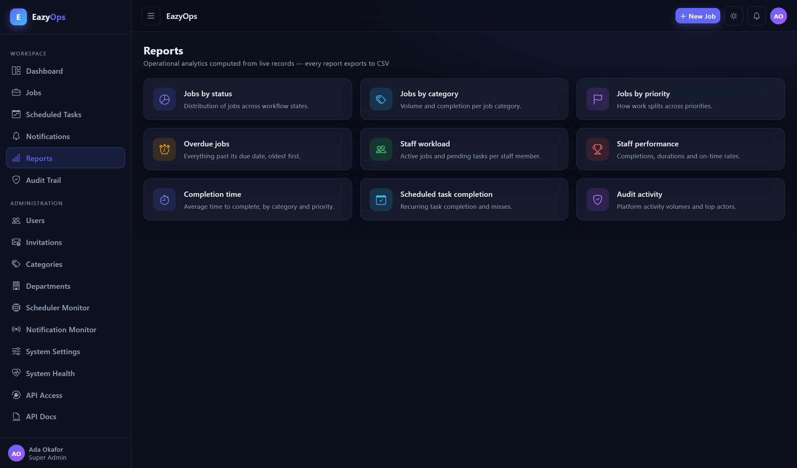
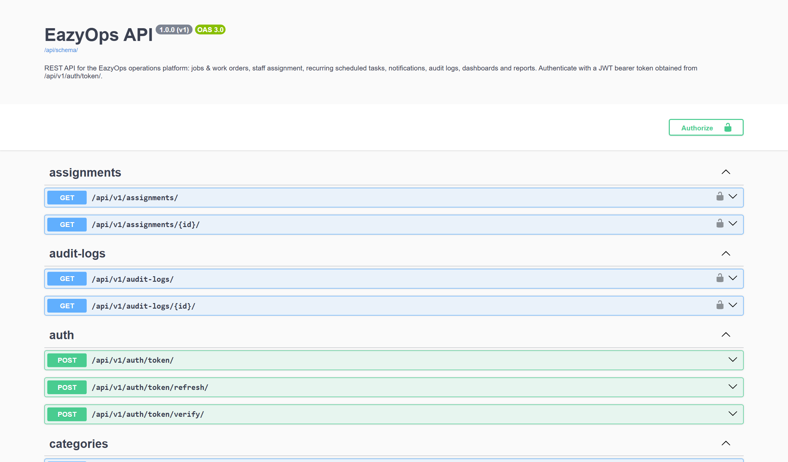
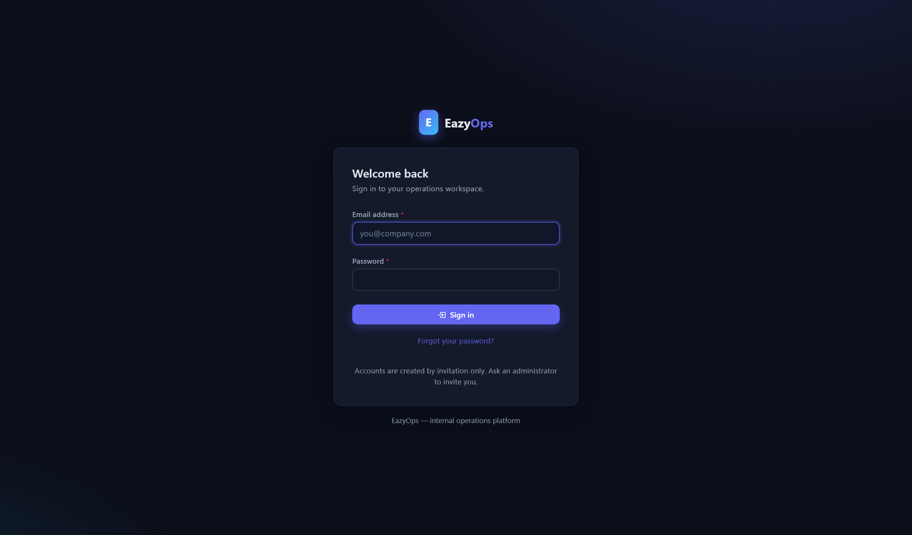

# EazyOps — Operations Backend & API

A production-quality internal operations platform built with **Django 5.2 LTS
and Django REST Framework**. EazyOps replaces spreadsheet-driven operations
work with structured jobs and work orders, staff assignment, a recurring-task
scheduler, role-based access control, a tamper-resistant audit trail,
notifications, reports, a premium custom dashboard and a fully documented
versioned REST API.




## Screenshots

| Dark dashboard | Light dashboard |
|---|---|
|  |  |

| Jobs & work orders | Job detail (workflow, timeline, evidence) |
|---|---|
|  |  |

| Scheduled tasks | Audit trail |
|---|---|
|  |  |

| Reports | API documentation (Swagger UI) |
|---|---|
|  |  |

<details>
<summary>Login page</summary>


</details>

## Feature overview

| Area | Highlights |
|---|---|
| **Accounts & RBAC** | Invitation-only registration, email login, four roles (Super Admin / Operations Manager / Operations Staff / Viewer-Client) enforced by a single capability map across web **and** API, login lockout, last-activity tracking, deactivation that preserves audit history |
| **Jobs / work orders** | Auto-generated job numbers (`JOB-2026-00042`), category/priority/department/tags/costs, validated status machine (Draft → Open → Assigned → In Progress → Awaiting Review → Completed/Cancelled + derived Overdue), multi-staff assignment, comments & progress updates, validated evidence uploads, per-job activity timeline, filters/search/sort/pagination, CSV export |
| **Scheduling** | One-time, daily, weekly, monthly and custom-interval templates; occurrences materialised per assignee (or per team); optional full-job creation per run; `run_scheduler` management command (cron-ready) with DB locking, bounded catch-up, execution logs, failure tracking, missed-occurrence sweep, overdue/due-soon job sweeps |
| **Audit trail** | Insert-only `AuditLog` (updates/deletes refused at model *and* queryset level), before/after field values, IP + user-agent capture, auth signals (login/logout/failed), searchable & filterable viewer |
| **Notifications** | In-app bell with unread badge + AJAX feed, history page, mark one/all read, email copies via environment-configured SMTP with per-user opt-out and a global switch |
| **Reports** | Status/category/priority distributions, staff workload, staff performance (avg days, on-time rate), overdue, completion time, scheduled-task completion, audit activity — all filterable and CSV-exportable, charts via Chart.js |
| **Custom admin area** | User & invitation management, categories & departments, scheduler monitor with manual run, notification monitor, editable system settings (audited), system health page, API access overview — Django admin remains as a restricted emergency backend |
| **REST API v1** | JWT auth (SimpleJWT) with lockout + audit, ~60 endpoints across 14 resources, consistent error envelope, filtering/search/ordering/pagination, per-scope throttles, OpenAPI schema + Swagger UI + ReDoc |
| **UI** | Custom dark/light theme (persisted), collapsible sidebar, sticky topbar, responsive tables, empty states, skeletons, toast notifications — Bootstrap 5, jQuery and Chart.js vendored locally (CSP-safe, no CDN) |

See [FEATURES.md](FEATURES.md) for the complete list.

## Tech stack

- **Backend**: Python 3.12+ · Django 5.2 LTS · Django REST Framework 3.17
- **Auth**: django auth (sessions) + SimpleJWT (API) · invitation-only onboarding
- **API tooling**: drf-spectacular (OpenAPI 3, Swagger UI, ReDoc) · django-filter
- **Database**: SQLite (development) · PostgreSQL-ready via `DATABASE_URL`
- **Frontend**: Django templates · Bootstrap 5.3 (colour modes) · vanilla JS + jQuery · Chart.js — all assets vendored, zero CDN
- **Ops**: whitenoise static serving · cron-compatible scheduler command · environment-driven configuration
- **Testing**: pytest + pytest-django (163 tests)

## Project layout

```
config/                 settings (base / dev / prod / test), urls, wsgi, asgi
apps/core/              RBAC capability map, Department, SystemSetting, validators,
                        security-headers middleware, seed_demo command
apps/accounts/          custom User (email login), invitations, lockout, auth views,
                        user management (custom admin area)
apps/operations/        jobs, categories, tags, assignments, comments, attachments,
                        status machine + service layer, CSV export
apps/scheduling/        ScheduledTask, TaskOccurrence, SchedulerRun/Lock,
                        recurrence engine, run_scheduler command
apps/notifications/     Notification model, fanout service, bell feed
apps/audits/            immutable AuditLog, record_audit service, auth signals
apps/reports/           aggregation services + report views + CSV
apps/dashboard/         dashboard widgets/data endpoint, settings/health/API pages
apps/api/               DRF v1: serializers, viewsets, JWT auth, throttles, schema
templates/, static/     dashboard UI (vendored Bootstrap 5.3, Chart.js, jQuery)
tests/                  pytest suite (163 tests)
docs/screenshots/       the images used in this README
```

Architecture notes: business rules live in per-app `services.py` modules that
both the web views and API viewsets call, so behaviour can never drift between
the two surfaces. Row-level access (`Job.objects.visible_to(user)`) is the
single source of truth for what each role can see.

## Quick start (local development)

Requirements: **Python 3.12+**. No external services needed — SQLite and a
console email backend are the development defaults.

```bash
# 1. Virtual environment
python -m venv .venv
.venv\Scripts\activate            # Windows
# source .venv/bin/activate       # Linux / macOS

# 2. Dependencies
pip install -r requirements-dev.txt

# 3. Environment
copy .env.example .env            # cp on Linux/macOS — defaults work for dev

# 4. Database migrations
python manage.py migrate

# 5. Create your admin account
python manage.py createsuperuser

# 6. Run the server
python manage.py runserver
```

Open <http://localhost:8000> and sign in.

### Demo data (optional, development only)

```bash
python manage.py seed_demo                 # departments, categories, users, 25+ jobs, schedules
python manage.py seed_demo --run-scheduler # …and execute one scheduler pass
python manage.py seed_demo --flush         # reset demo objects first
```

Demo accounts (password `DemoPass123!`): `admin@eazyops.local`,
`manager@eazyops.local`, `staff1–4@eazyops.local`, `viewer@eazyops.local`.
The command refuses to run when `DEBUG=False`.

### Tests & checks

```bash
pytest                                   # 163 tests, ~2 s
python manage.py check                   # system checks
python manage.py makemigrations --check  # no missing migrations
python manage.py check --deploy          # production hardening checklist
```

Coverage details: [TESTING.md](TESTING.md).

## The scheduler

All recurring behaviour (materialising scheduled tasks, marking missed
occurrences, flagging overdue jobs, due-soon notices) runs in one idempotent
pass:

```bash
python manage.py run_scheduler
```

Production cron (every 5 minutes is safe — a DB lock skips overlapping runs
and unique constraints make slot creation idempotent):

```cron
*/5 * * * *  cd /srv/eazyops && .venv/bin/python manage.py run_scheduler >> /var/log/eazyops/scheduler.log 2>&1
```

On Windows, schedule the same command with Task Scheduler. Every pass is
recorded on the **Scheduler Monitor** page (`/schedule/runs/`), and admins can
trigger a manual pass from the UI.

## REST API

* Interactive docs (Swagger UI): **`/api/docs/`**
* ReDoc: `/api/redoc/` · OpenAPI 3 schema: `/api/schema/`

```bash
# Obtain a JWT pair
curl -X POST http://localhost:8000/api/v1/auth/token/ \
     -H "Content-Type: application/json" \
     -d '{"email":"admin@eazyops.local","password":"DemoPass123!"}'

# Use it
curl http://localhost:8000/api/v1/jobs/?status=OVERDUE \
     -H "Authorization: Bearer <access>"
```

Endpoint reference, error envelope and examples: [API.md](API.md).

## Environment variables

Everything deploy-specific comes from the environment (see
[ENVIRONMENT.md](ENVIRONMENT.md) and [.env.example](.env.example)):
`SECRET_KEY`, `DEBUG`, `ALLOWED_HOSTS`, `DATABASE_URL` (PostgreSQL in
production, SQLite fallback for dev), `EMAIL_*` SMTP settings,
`CSRF_TRUSTED_ORIGINS`, `SITE_URL`, plus lockout/upload/due-date tuning knobs
that are also editable at runtime from the admin area.

## Security notes

- Backend-enforced RBAC with row-level scoping — cross-tenant probes return
  404, never 403, so record existence does not leak.
- Failed-login lockout (per-account and per-IP) on both the web form and the
  JWT endpoint; all auth events audited with IP and user agent.
- Insert-only audit log — updates and deletes are refused at the model and
  queryset level.
- Uploads validated by extension whitelist, size cap, content-type
  cross-check and image verification; attachments served only through
  permission-checked views, never raw media URLs.
- Strict `Content-Security-Policy` (`script-src 'self'`, no inline scripts,
  no CDN), HSTS, secure cookies, SSL redirect and hardened production
  settings that refuse to boot with a placeholder secret.
- Scoped API rate limits (tight on credential endpoints), CSRF everywhere,
  custom 403/404/500 pages, secrets only via environment variables.

Full write-up: [SECURITY.md](SECURITY.md) ·
Deployment guide: [DEPLOYMENT.md](DEPLOYMENT.md) ·
Release history: [CHANGELOG.md](CHANGELOG.md)

## License

Released under the [MIT License](LICENSE).
